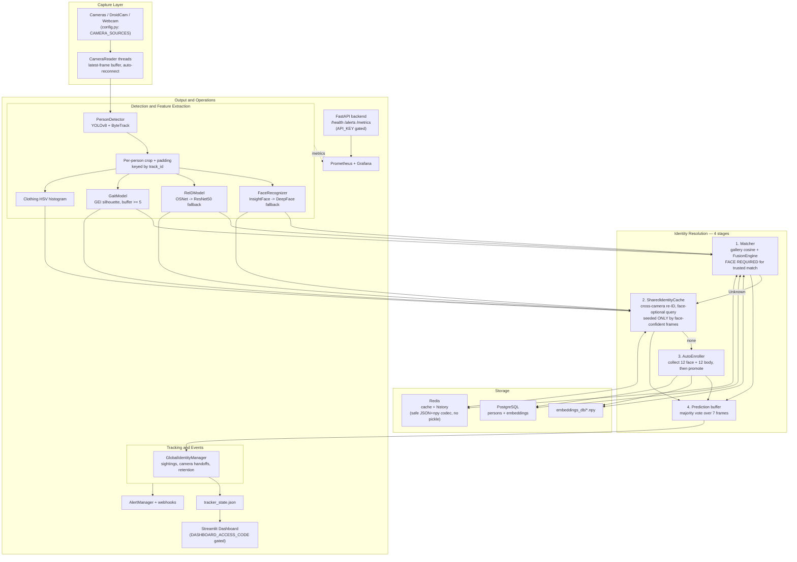

# Multi-Modal Biometric Tracking System

A real-time, multi-camera person identification and tracking system that fuses **face recognition**, **body re-identification (ReID)**, and **gait analysis** to stay robust when any single modality fails. It ships with a four-stage identity-resolution pipeline, a live operations dashboard, PostgreSQL + Redis persistence, and full Prometheus/Grafana observability.

[](https://www.python.org/)
[](https://pytorch.org/)
[](https://opencv.org/)
[](https://fastapi.tiangolo.com/)
[](https://streamlit.io/)

---

## Table of Contents

- [Overview](#overview)
- [Architecture](#architecture)
- [How It Works (End-to-End)](#how-it-works-end-to-end)
- [The Four-Stage Identity Pipeline](#the-four-stage-identity-pipeline)
- [Key Engineering Decisions](#key-engineering-decisions)
- [Security & Hardening](#security--hardening)
- [Tech Stack](#tech-stack)
- [Project Structure](#project-structure)
- [Setup](#setup)
- [Configuration](#configuration)
- [Running the System](#running-the-system)
- [Deployment](#deployment)
- [Monitoring & Observability](#monitoring--observability)
- [Known Limitations & Future Work](#known-limitations--future-work)
- [Authors & Acknowledgements](#authors--acknowledgements)

---

## Overview

Single-modality biometric systems break in the real world: faces get occluded, people walk away from the camera, lighting changes. This system combines three complementary biometric signals plus a clothing-colour cue so identification degrades gracefully instead of failing outright.

- **Face recognition** — the primary, most discriminative signal.
- **Body re-identification (ReID)** — a secondary signal when the face is not visible.
- **Gait** — a tertiary cue for people seen at a distance or from behind.
- **Clothing histogram** — a short-lived appearance cue used only for cross-camera continuity.

People are distinguished purely by **biometric identity** (a `Person ID`); there is no login or role system. Identities are stored as per-person, per-modality embeddings and matched by cosine similarity with weighted fusion.

---

## Architecture



> The same diagram is also available standalone at [`docs/architecture.mermaid`](docs/architecture.mermaid).

---

## How It Works (End-to-End)

1. **Capture.** Each camera is read by its own `CameraReader` thread that keeps only the latest frame (so inference never falls behind a backlog) and auto-reconnects if the stream drops.
2. **Detect & track.** `PersonDetector` runs YOLOv8 with ByteTrack, producing stable `track_id`s and bounding boxes for each person.
3. **Extract features.** For each padded person crop the system computes a face embedding, a body ReID embedding, a gait GEI (once a 5+ frame buffer exists), and a clothing-colour histogram.
4. **Resolve identity.** The crop's features pass through the four-stage pipeline below.
5. **Smooth.** A per-track 7-frame majority vote suppresses single-frame flicker.
6. **Record.** `GlobalIdentityManager` logs sightings, detects camera-to-camera handoffs, and enforces retention.
7. **Surface.** Tracker state is written to `tracker_state.json` (read by the Streamlit dashboard), metrics flow to Prometheus, and alerts fire on camera/health events.

---

## The Four-Stage Identity Pipeline

Identity is resolved by trying progressively looser strategies, each with its own trust rules:

1. **Matcher (gallery match).** Compares the live embeddings against the registered gallery using cosine similarity and the `FusionEngine`. This is the **high-precision path** — it only returns a *trusted* identity when a face is present, applies a gallery-size-aware dynamic threshold, and requires a minimum margin over the runner-up.
2. **SharedIdentityCache (cross-camera re-ID).** A short-lived, in-memory + Redis cache of recently-confident identities. It **can identify without a face** (using body + gait + clothing), which is what lets the system keep a name on someone walking away or crossing between cameras. Crucially, cache entries are **only seeded/refreshed by face-confident frames**, so a no-face query can never bootstrap an identity from clothing alone.
3. **AutoEnroller (provisional capture).** If a person is genuinely unknown, the enroller starts collecting their embeddings (12 face + 12 body) under a temporary `Person_N` label and promotes them into the gallery once enough are gathered. They can be renamed live via admin controls.
4. **Prediction smoothing.** Whatever the source, the final per-track label is a majority vote over the last 7 frames.

---

## Key Engineering Decisions

**Multi-modal fusion with a two-tier trust model.** Different sub-systems intentionally weight the modalities differently because they solve different problems, and the weights now live in a single source of truth (`utils/config.py`):

| Sub-system | Weights | Why |
|---|---|---|
| `FusionEngine` (gallery) | face 0.65, body 0.35, gait 0.01 | High-precision identification; face dominates, gait is near-useless on a frontal camera. A trusted result **requires** a face. |
| `SharedIdentityCache` | face 0.50, body 0.30, gait 0.15, cloth 0.05 | Short-term cross-camera continuity where the face is often missing, so body/gait/clothing carry more weight. |
| `AutoEnroller` | face 0.65, body 0.35 | Only links a new track to an existing candidate; gait/clothing aren't collected during enrollment. |

The "face required for the gallery, face optional for the cache" split is deliberate: the gallery is the **system of record** and must not guess, while the cache exists precisely to maintain continuity when the face momentarily disappears — but only after a real face match seeded it.

**Multi-exemplar embeddings.** Each person is stored as a stack of N exemplars rather than a single averaged vector, and matching takes the **max** similarity across exemplars. This is far more robust to pose/lighting variation than a single mean.

**Dynamic threshold + margin gate.** The acceptance threshold scales with gallery size (more enrolled people → stricter threshold), and a candidate must beat the runner-up by a margin. Both reduce false positives as the gallery grows.

**Graceful model fallbacks — made loud.** Face uses InsightFace with a DeepFace fallback; body uses OSNet with a ResNet50 fallback. The fallbacks now emit an unmissable warning (and can be made a hard failure via `REID_REQUIRE_OSNET=1`), because a silent fallback previously caused the gallery to be built on the wrong backbone. The matcher also guards against embedding-dimension mismatches so a backbone change can't crash identification.

**Latest-frame camera threads.** Each camera runs in its own thread exposing only the most recent frame, decoupling capture from inference and preventing latency build-up.

**Layered persistence.** PostgreSQL is the durable store for persons/embeddings; Redis caches embeddings, the shared identity cache, and detection history; `.npy` files are the zero-dependency local fallback. All three are tried in order so the system runs even with no database or cache available.

**Observability first.** Prometheus metrics (FPS, detections, identifications, matching latency, model-load time, camera status), a JSON alerting layer with optional Slack/Discord webhooks, and Grafana dashboards are built in rather than bolted on.

---

## Security & Hardening

This codebase received a security and robustness pass. The notable changes:

- **Removed insecure deserialization (RCE).** The Redis layer previously used `pickle`, so anyone able to write to Redis could execute code in the tracker/API process. It now uses a safe JSON + base64-`.npy` codec (`np.load(..., allow_pickle=False)`), which can never execute code on load.
- **Authentication on all sensitive surfaces.** The FastAPI endpoints (`/metrics`, `/alerts`, detailed `/health/*`) require an `X-API-Key` header (`API_KEY`), and the Streamlit dashboard is gated by `DASHBOARD_ACCESS_CODE`. Both auto-disable when their env var is unset, so local development is frictionless. Liveness/root health checks stay open for orchestrator probes.
- **Loud model fallbacks + dimension guard.** As above — no more silent accuracy degradation, and no crash on a backbone/embedding-dimension change.
- **Bounded memory.** Per-track gait/prediction buffers and the enroller's track map are now pruned on a TTL, preventing unbounded growth on long-running feeds.
- **Correct deployment wiring.** `render.yaml` now provisions managed Postgres + Redis and injects their real connection strings by reference (the previous version hardcoded placeholder URLs, causing silent fallback). Secrets use `sync: false`.
- **Bug fixes.** A valid `track_id` of `0` was being discarded (`x or idx`); the Redis connection is now pooled instead of re-dialled on every call; `/health/models` no longer reports a misleading hardcoded status.

> **Privacy note.** The `AutoEnroller` automatically captures and stores the biometrics of unknown people. This is an intended feature for controlled/academic deployments, but capturing biometric data of real individuals without notice/consent may be regulated in your jurisdiction (e.g. GDPR, BIPA). Operate accordingly.

---

## Tech Stack

| Category | Technologies |
|---|---|
| Language | Python 3.10+ |
| Detection / tracking | Ultralytics YOLOv8, ByteTrack |
| Face | InsightFace (`buffalo_sc`) → DeepFace (FaceNet) fallback |
| Body ReID | OSNet-x1.0 (MSMT17) → ResNet50 fallback |
| Gait | Custom GEI silhouette (GPU-accelerated) |
| Deep learning / CV | PyTorch, TorchVision, OpenCV, NumPy |
| Backend API | FastAPI, Uvicorn |
| Dashboard | Streamlit |
| Persistence | PostgreSQL (`psycopg2`), Redis |
| Observability | Prometheus, Grafana, `prometheus-fastapi-instrumentator` |
| Packaging | Docker, Docker Compose, Render Blueprint |

---

## Project Structure

```
Biometric-Tracking-System/
├── backend/             # FastAPI app + per-modality registration scripts
│   ├── app.py           #   health, alerts, metrics (API-key protected)
│   └── register*.py     #   face / body / gait enrollment tools
├── core/                # Orchestration & matching
│   ├── multi_tracker.py #   multi-camera tracker, cache, auto-enroller, handoff
│   ├── matcher.py       #   gallery match + dimension guard
│   ├── fusion_engine.py #   weighted score fusion (gallery)
│   └── tracker.py       #   single-camera tracker (legacy)
├── models/              # detector, face, reid (OSNet), gait
├── utils/               # config (weights/source of truth), embeddings, similarity
├── database/db.py       # PostgreSQL persistence
├── cache/redis_cache.py # Redis cache (safe codec)
├── monitoring/          # Prometheus metrics + alerting
├── iot_stream/          # camera reader / demo
├── grafana/             # dashboards + provisioning
├── docs/architecture.mermaid
├── dashboard.py         # Streamlit dashboard (access-code protected)
├── run_tracker_multi.py # entry point: multi-camera tracker
├── render.yaml          # Render Blueprint (managed PG + Redis)
└── docker-compose.yml   # local multi-service stack
```

---

## Setup

```bash
# 1. Clone
git clone https://github.com/sarthaksenapati/multimodal-biometric-tracking.git
cd multimodal-biometric-tracking

# 2. Virtual environment
python -m venv venv
source venv/bin/activate        # Windows: venv\Scripts\activate

# 3. Dependencies
pip install -r requirements.txt

# 4. Camera config
cp config.example.py config.py  # then edit IPs/sources

# 5. (Optional) place OSNet weights for full body-ReID accuracy
#    osnet_x1_0_msmt17.pth in the project root
```

**Model weights.** YOLOv8 downloads automatically. InsightFace/DeepFace download on first use. For body ReID, place `osnet_x1_0_msmt17.pth` in the project root — **without it the system falls back to ResNet50 and prints a clear warning** (set `REID_REQUIRE_OSNET=1` to fail fast instead).

---

## Configuration

Camera sources and locations live in `config.py` (copied from `config.example.py`):

```python
CAMERA_SOURCES   = {0: 0, 1: "http://<droidcam-ip>:4747/video"}
CAMERA_LOCATIONS = {0: "Main Entrance", 1: "Hallway"}
```

Fusion weights and thresholds are centralized in `utils/config.py`.

**Environment variables:**

| Variable | Purpose | Default |
|---|---|---|
| `DATABASE_URL` | PostgreSQL connection string | local `.npy` fallback if unset |
| `REDIS_URL` | Redis connection string | `redis://localhost:6379` |
| `API_KEY` | Protects FastAPI sensitive endpoints | unset = auth disabled (dev) |
| `DASHBOARD_ACCESS_CODE` | Gates the Streamlit dashboard | unset = open (dev) |
| `REID_REQUIRE_OSNET` | Fail instead of ResNet50 fallback | unset = fallback allowed |
| `ALERT_WEBHOOK_URL` | Slack/Discord alert webhook | unset = no webhook |

---

## Running the System

```bash
# Register people (one per modality, as needed)
python backend/register.py          # face
python backend/register_body.py     # body
python backend/register_gait.py     # gait

# Terminal 1 — run the multi-camera tracker (+ Prometheus on :8001)
python run_tracker_multi.py

# Terminal 2 — run the dashboard
python -m streamlit run dashboard.py
```

Live admin commands (renaming `Person_N`, force-promote, reset) are issued via `utils/admin_controls.py` and picked up by the running tracker.

---

## Deployment

**Docker Compose (local stack):**

```bash
docker compose up --build
# backend :8000, dashboard :8501, plus tracker/postgres/redis/prometheus/grafana
```

**Render (cloud):** `render.yaml` is a Blueprint that provisions managed Postgres and Redis and wires their connection strings into both services automatically. Set `API_KEY` and `DASHBOARD_ACCESS_CODE` in the Render dashboard (declared as `sync: false`). Note that real-time camera capture requires camera access not available on Render's web dynos — cloud deployment is intended for the API/dashboard/persistence tiers.

---

## Monitoring & Observability

- **Prometheus metrics** (`/metrics` on the API, port `8001` from the tracker): FPS, detections, identifications, matching latency, model-load time, camera status.
- **Grafana**: dashboards and provisioning under `grafana/`.
- **Alerting**: `monitoring/alerts.py` records camera-offline/online and health events to `alerts.json` and can POST to a Slack/Discord-compatible webhook.
- **Health endpoints**: `/health/live`, `/health/ready`, `/health/cameras`, `/health/models`, `/health/full`.

---

## Known Limitations & Future Work

Honest about where the system stands:

- **Gait is a weak signal.** The GEI is computed from a simple global threshold on varying-scale crops without background subtraction or alignment; its fusion weight is intentionally tiny. Treat it as a tie-breaker, not a reliable modality. A proper silhouette segmentation + gait network is future work.
- **Evaluation is illustrative.** Accuracy figures are indicative, not the output of a held-out benchmark. A reproducible evaluation harness (CMC/ROC, per-modality ablation) is needed for real claims.
- **Reproducibility.** `requirements.txt` is currently unpinned; pinning exact versions (and setting seeds) would make builds reproducible.
- **Backend/tracker metrics are split across processes.** The API's `/metrics` and the tracker's `:8001` exporter are separate; Prometheus should scrape both.
- **Database/Redis availability is probed once at import.** A reconnect/health-retry loop would make the system self-heal if a backing service starts after the app.
- **Auto-enroll runs promotion on the inference thread.** Promotion (embedding write + gallery reload) is synchronous; moving it to a background worker would remove the occasional frame stall.
- **ReID embeds the full crop** (including background), so scene context can leak into the body signature; tighter person segmentation would help.

---

## Authors & Acknowledgements

Built and maintained by **Sarthak Senapati**.

Originally developed in collaboration with **Prityanshu Yadav**, whose work on the early face/body pipeline is part of this project's history. Thank you for the collaboration.

---

*This README documents the system as hardened in 2026, including the security pass described in [Security & Hardening](#security--hardening).*
